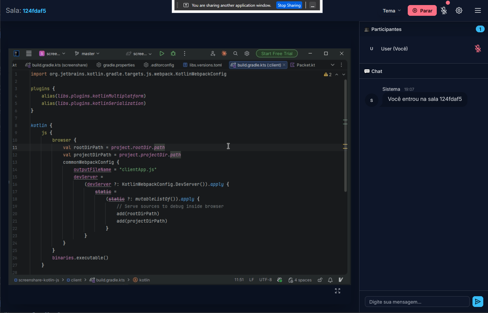
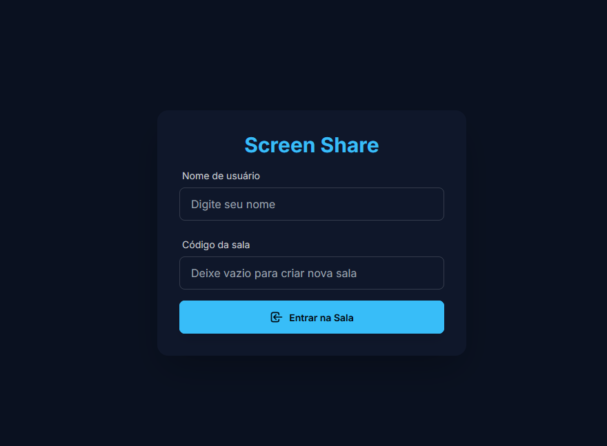
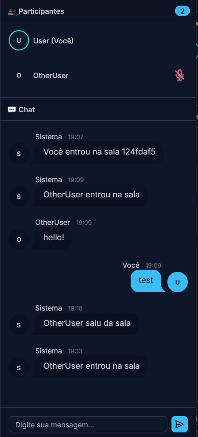
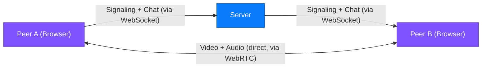

<!-- prettier-ignore -->
<div align="center">

# Screenshare

Real-time screen sharing and voice chat application built with Kotlin Multiplatform

[](https://screen-share.fly.dev/)
[](https://kotlinlang.org)
[](https://ktor.io)
[](LICENSE)

[Overview](#overview) • [Features](#features) • [Architecture](#architecture) • [Getting started](#getting-started) • [Running](#running) • [Deployment](#deployment)



</div>

## Overview

Screenshare is a peer-to-peer screen sharing and voice chat application. The client is written entirely in **Kotlin/JS** using WebRTC for media streams, while the signaling server runs on the **JVM** with Ktor. Both share a common data model through **Kotlin Multiplatform**.

Users create or join rooms, share their screen, and communicate via real-time voice chat — all from the browser with no plugins required.

> [!TIP]
> Try it now at **https://screen-share.fly.dev/** — no installation needed.

## Features

- **Screen sharing** — Stream your screen at up to 1080p/60fps using the browser's `getDisplayMedia` API.
- **Voice chat** — Built-in microphone support with echo cancellation, noise suppression, and real-time speaking indicators.
- **Room-based sessions** — Create rooms with shareable IDs and join from any browser.
- **Text chat** — In-room messaging with chat history replayed for late joiners.
- **Peer-to-peer media** — Audio and video travel directly between peers via WebRTC; the server only handles signaling.
- **Responsive UI** — DaisyUI + Tailwind CSS interface with multiple themes, fullscreen mode, participant list, and animated speaking indicators.

<div align="center">
  
  &nbsp;
  
</div>

## Architecture

The project is a Gradle multi-module Kotlin Multiplatform application:

```
screenshare/
├── common/        Shared data models and serialization (JS + JVM)
├── client/        Kotlin/JS browser app (WebRTC, UI, Ktor WebSocket client)
├── client-kmp/    Kotlin Multiplatform client (Desktop + wasmJs browser)
├── server/        Ktor signaling server (WebSockets, room management)
└── server-java/   Deployment wrapper (fat JAR packaging, Docker, Fly.io)
```

| Module | Target | Description |
|---|---|---|
| **common** | JS + JVM | `@Serializable` packet types for all client ↔ server messages (`JoinRoom`, `SendDescription`, `IceCandidateReceived`, etc.) |
| **client** | Kotlin/JS (Browser) | Single-page app compiled to `clientApp.js`. Manages WebRTC peer connections, screen capture, voice chat, and the DaisyUI interface. |
| **client-kmp** | Desktop (JVM) + wasmJs (Browser) | Compose Multiplatform client sharing UI and business logic across targets. Uses [webrtc-kmp](libs/webrtc-kmp) (aschulz90 fork) for native WebRTC on the JVM desktop target. |
| **server** | JVM (KMP) | Ktor CIO server exposing a WebSocket endpoint for signaling. Handles room lifecycle, user presence, chat history, and ICE/SDP relay. Built with KMP so additional targets (e.g. Kotlin/Native) can be added directly to this module. |
| **server-java** | JVM | Packages the server into a fat JAR for deployment. |

### Communication flow



1. Clients connect to the server via **WebSocket**.
2. When a user starts sharing or joins a room, the server broadcasts presence events.
3. Peers exchange **ICE candidates** and **SDP descriptions** through the server.
4. Once negotiation completes, **audio and video streams flow directly peer-to-peer** via WebRTC.

## Getting started

### Prerequisites

- [JDK 21+](https://adoptium.net/) (Amazon Corretto, Temurin, or similar)
- [Gradle](https://gradle.org/install/) (or use the included `gradlew` wrapper)

### Clone the repository

```bash
git clone https://github.com/rafaelrain/screenshare-kotlin-js.git
cd screenshare-kotlin-js
```

## Running

### Development

Start the server in development mode (with hot-reload enabled via Ktor's `io.ktor.development=true`):

```bash
./gradlew :server-java:run
```

This will:
1. Compile the Kotlin/JS client and bundle it with Webpack.
2. Copy the client assets into the server's static resources.
3. Start the Ktor server on **http://localhost:8080**.

Open the URL in your browser, enter a username and room ID, and you're ready to share.

> [!TIP]
> Share the same room ID with another person (or open a second browser tab) to test screen sharing and voice chat.

### Build only

```bash
# Build the client JS bundle
./gradlew :client:jsBrowserDistribution

# Build the server fat JAR
./gradlew :server-java:buildFatJar
```

### client-kmp — Desktop (JVM)

The desktop target is a native Compose Multiplatform window with real WebRTC via [webrtc-kmp](libs/webrtc-kmp).  
The server must be running separately before launching the desktop app.

**1. Start the signaling server:**

```bash
./gradlew :server-java:run
```

**2. In another terminal, launch the desktop app:**

```bash
./gradlew :client-kmp:run
```

The app connects to `ws://localhost:8080` by default. You can override the server address:

```bash
./gradlew :client-kmp:run --args="--host=192.168.1.10 --port=8080"
# Use --secure to switch to WSS (defaults to port 443)
./gradlew :client-kmp:run --args="--host=screen-share.fly.dev --secure"
# Pre-fill a room ID
./gradlew :client-kmp:run --args="--host=localhost --room=myroom"
```

> [!NOTE]
> The first run downloads the platform-specific `webrtc-java` native library for your OS/arch
> (`windows-x86_64`, `linux-x86_64`, `macos-aarch64`, etc.). This happens automatically via Gradle.

### client-kmp — Browser (wasmJs)

The wasmJs target is a Compose-for-Web app running in the browser and using the standard WebRTC browser APIs.  
The webpack dev server proxies WebSocket connections to the backend, so the server must be running.

**1. Start the signaling server:**

```bash
./gradlew :server-java:run
```

**2. In another terminal, start the wasmJs dev server:**

```bash
./gradlew :client-kmp:wasmJsBrowserDevelopmentRun --continuous
```

Open **http://localhost:8081** in your browser (the webpack dev server port). The app auto-connects to the server via `window.location`, so no extra configuration is needed.

> [!TIP]
> Adding `--continuous` enables incremental recompilation on source changes.

### Run tests

```bash
./gradlew check
```

Tests use [Kotest](https://kotest.io/) and cover serialization round-trips for all packet types.

## Deployment

The `server-java` module includes everything needed for containerized deployment.

### Docker

```bash
cd server-java
docker compose up --build
```

The included [Dockerfile](server-java/Dockerfile) uses Amazon Corretto 21 Alpine and exposes port **8080**.

### Fly.io

The project ships with a [fly.toml](server-java/fly.toml) configured for the `gru` (São Paulo) region:

```bash
fly deploy
```

> [!NOTE]
> The Fly.io configuration uses a shared CPU with 256 MB RAM, auto-stop/start, and force HTTPS. Adjust `fly.toml` to match your needs.

## Tech stack

| Layer | Technology |
|---|---|
| Language | [Kotlin 2.3](https://kotlinlang.org) (Multiplatform) |
| Client (browser, legacy) | Kotlin/JS, WebRTC, Web Audio API |
| Client (desktop + browser) | [Compose Multiplatform 1.10](https://www.jetbrains.com/compose-multiplatform/), [webrtc-kmp](https://github.com/aschulz90/webrtc-kmp) |
| Server | [Ktor 3.4](https://ktor.io) (CIO engine, WebSockets) |
| Serialization | [kotlinx.serialization](https://github.com/Kotlin/kotlinx.serialization) |
| UI | [DaisyUI](https://daisyui.com) + [Tailwind CSS](https://tailwindcss.com) |
| Testing | [Kotest 6](https://kotest.io) |
| Build | [Gradle](https://gradle.org) with Kotlin DSL & version catalogs |
| Deployment | Docker, [Fly.io](https://fly.io) |
